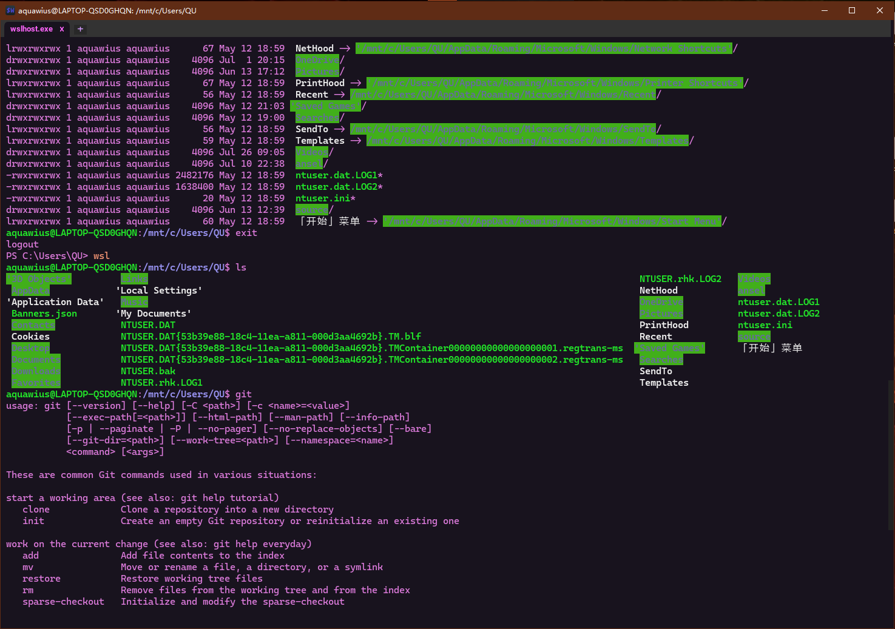
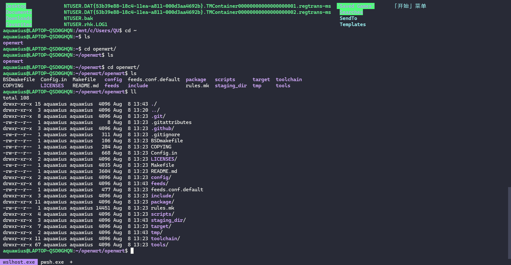

## 参考
0. [官方配置文档](https://wezfurlong.org/wezterm/config/keys.html)
1. [WezTerm 跨系统终端 和 Lua 配置](https://juejin.cn/post/7149992306706219039)
2. [逐步搭建现代大一统终端(Alacritty +Zellij -> WezTerm)](https://zhuanlan.zhihu.com/p/436024560)

## 这是一个我自己的wezterm配置文件


### 使用方法

1. 将本仓库拷贝

``` powershell
git clone https://gitee.com/aquawius/wezterm-config.git
```

2. 将拷贝的文件放在 `C:/Users/用户名/.config/`下(没有`.config`文件夹则创建`.config`文件夹)

> ##### 完整文件结构应该这样
>
> ``` powershell
> C:\USERS
> ├─Public
> ├─QU(你的用户名)
> │  ├─Documents
> │  ├─Downloads
> │  ├─Music
> │  ├─Pictures
> │  ├─Videos
> │  ├─.config
> │  │  ├─git
> │  │  └─wezterm
> │  │     └─.git   (delete it)
> │  │     dracula.lua
> │  │     readme.md
> │  │     wezterm.lua
> │  │        ...
> ```

~~当然你可以直接进入`C:/Users/用户名/.config/`然后`git clone`~~

3. 完成!

> 提示: 使用鼠标中键点击tab,可以关闭该tab

##### 欢迎提PR或Issue

### 后记

> ###### 关于终端
>
> > 这里默认使用的终端是`powershell 7`,你可以更改为任意类型的终端,比如`cmd.exe`, `powershell 5(powershell.exe)`, `powershell 7(pwsh.exe)`
> >
> > 修改方式是在`./config/wezterm/wezterm.lua`中找到
> > `default_prog = { 'pwsh' },` 将`{ }`中的`'pwsh'`改为你想要的终端 (绝对路径或者环境变量都可以)
>
> ###### 主题配色
>
> > 原本是我自己写的配置,用的自带的Sukura配色加上自己写的tab栏, 现在的配置文件改为使用[dracula官方提供的配色](https://github.com/dracula/wezterm.git)
> >
> > **原来的**
> >
> > 
> >
> > Dracula**官方提供的配色**
> >
> > 
> >
> > 怎么说,还是Dracula好看!  **Dracula yyds!**
>
> ###### 关于配置文件
>
> > 实话的说,我是从一个github的用户Ctrl-CV来的,名字已经忘记了,中间也被我改了一些东西,在此感谢那位不知名的github大佬,也要感谢wezterm带来了如此丰富的自定义终端!

